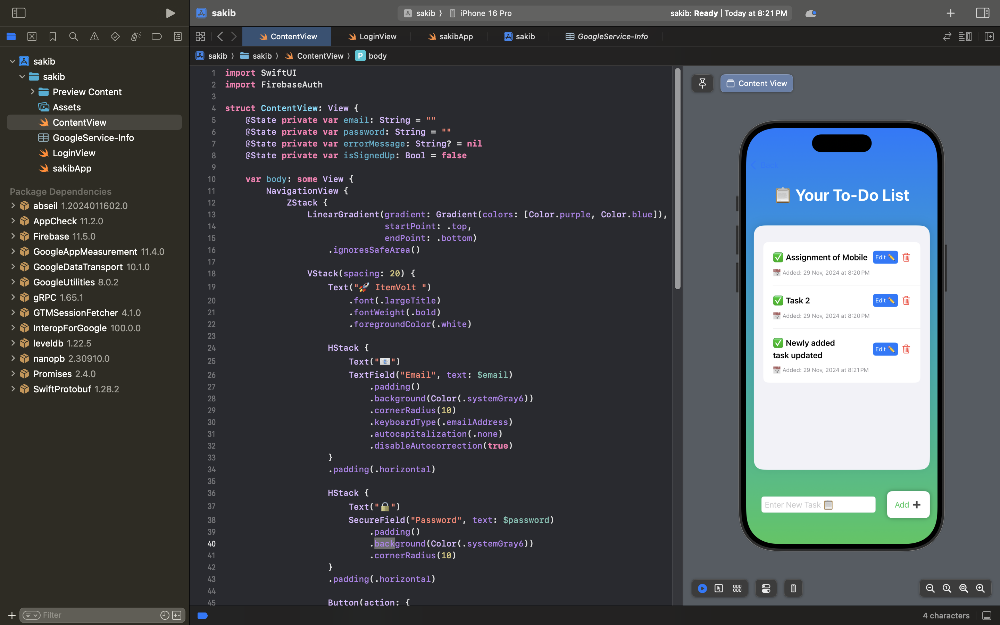
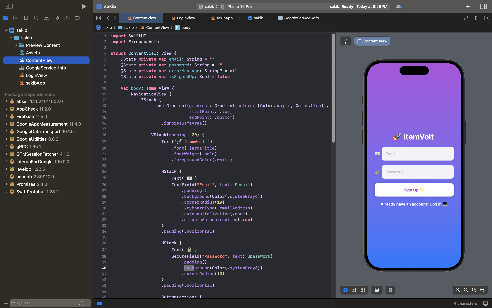
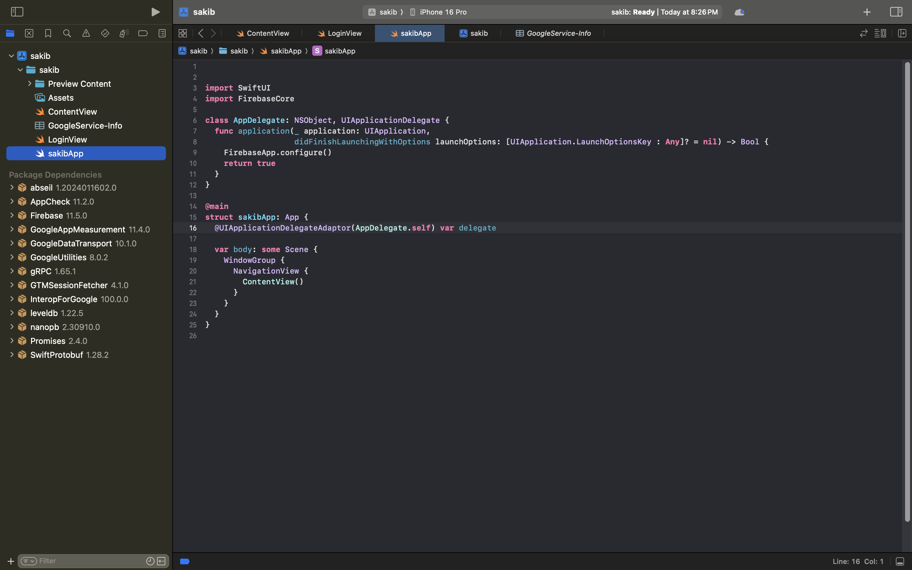
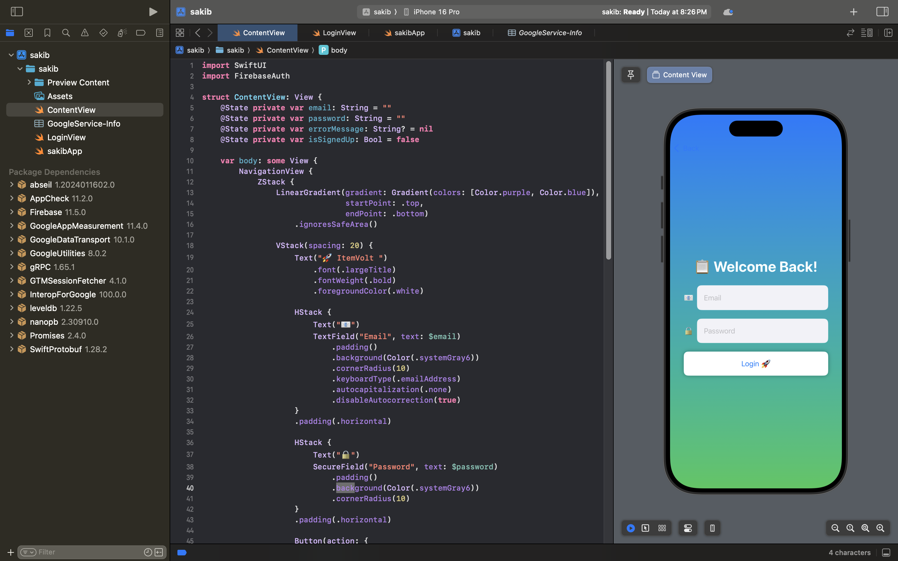

# 🛠️ Firebase Authentication & Firestore CRUD Assignment  

Welcome to the **Firebase Authentication & Firestore CRUD** assignment repository! This project demonstrates the integration of Firebase Authentication, Google Firestore, and a simple yet elegant UI to perform **CRUD operations**.  

## 🌟 Features  
- 🔐 **User Authentication** (Login & Registration).  
- 📋 **Task Management**: Add, Update, Delete, and View tasks.  
- 🚀 **Google Firestore** as the backend database.  
- 🎨 A clean and user-friendly UI designed with ListView.  

---

## 🧑‍💻 Team Members  
1. **Md. Sakibur Rahman** (Roll: 2007007)  
   - 📝 Implemented **Registration**.  
   - 🗂️ Developed **Basic Data Fetching** and **Read Operation** from Firestore.  
   - 🎨 Designed the **Task ListView UI**.  

2. **Fariha Sanzana** (Roll: 2007024)  
   - 🛠️ Implemented **Delete and Update Operations** from Firestore.  
   - 🎨 Designed the **Delete and Update UI**.  

3. **Hasibul Hasan** (Roll: 2007025)  
   - 🔑 Designed the **Login View**.  
   - ➕ Developed the **Add Task to Firestore** functionality.  
   - 🎨 Created the **Add Button UI**.  

---

## 📂 Project Overview  

### 🖼️ Screenshots  
1️⃣ **Task ListView**  
  

2️⃣ **Registration Screen**  
  

3️⃣ & 4️⃣ **Code Snippets**  
  
  

5️⃣ **Login Screen**  
  

---

### 🎥 Demo Video  
📺 Watch the full demo of how the app works [here](https://youtube.com/your-video-link).  

---

## 🛠️ Technologies Used  
- **Frontend**: SwiftUI  
- **Backend**: Firebase Authentication & Google Firestore.  
- **Language**: Swift  
- **Version Control**: Git & GitHub.  

---

